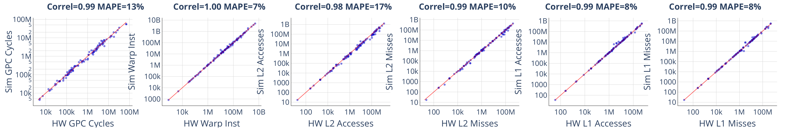
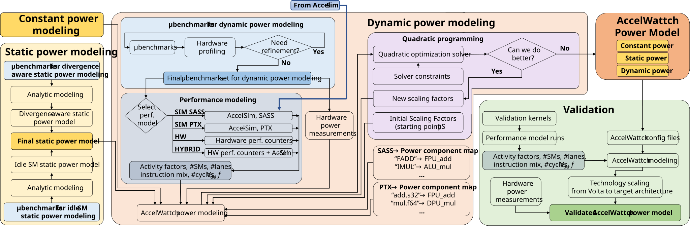

# Accel-Sim 2.0 — Validated GPU Simulation with full Hopper support

[](https://codespaces.new/accel-sim/accel-sim-framework) [](https://github.com/accel-sim/accel-sim-framework/actions/workflows/main.yml)

Accel-Sim is an extensible, **validated** framework for cycle-level GPU simulation.
It traces real SASS execution from NVIDIA hardware with NVBit and replays it on a detailed performance model (GPGPU-Sim 4.x), together with the AccelWattch power model.

**Accel-Sim 2.0** adds **full NVIDIA Hopper (H100 / H200) support**: the Tensor Memory Accelerator (TMA), asynchronous Warp Group MMA (WGMMA), `mbarrier` producer/consumer synchronization, threadblock clusters, a chiplet / uGPU partitioned memory subsystem, a rebuilt tracer (compressed traces + PyTorch per-layer hooks), and **GPUVision** for cycle-level hardware correlation.
See the full changelog and **Table 1** in [release.notes.md](release.notes.md).

> ### 🚀 Simulate contemporary LLM inference and training, end to end
> Accel-Sim 2.0 **fully supports vLLM inference and PyTorch training** — grab any model from
> Hugging Face, trace inference or a full training step (forward + backward + optimizer) with
> a few lines of Python, and run it on a cycle-level model of an H100. No hand-written
> kernels, no unsupported-op workarounds: modern async Hopper kernels (FlashAttention-3,
> cuBLAS/CUTLASS, NCCL) run out of the box.
>
> **And it's accurate.**
> Validated across **34,000+ kernel instances** from **22 benchmark suites**, Accel-Sim 2.0 achieves a **99% Pearson correlation** and just **13.4% mean absolute cycle error** against real NVIDIA H100 silicon.
>
> → Jump to [**Tracing LLMs with vLLM**](#tracing-llms-with-vllm).



*Simulated vs. real H100 across 34,000+ kernels — GPC cycles, warp instructions, and L1/L2 accesses & misses.
Each panel shows the Pearson correlation and mean absolute percentage error (MAPE) for that metric.*

> **Roadmap:** experimental **Blackwell (B200 / RTX 5090)** and **multi-GPU / NVLink** support are incoming shortly.

## Contents
- [How to Cite](#how-to-cite)
- [Dependencies](#dependencies)
- [Quick Start](#quick-start)
- [Full Hopper Support](#full-hopper-support)
- [**Tracing with vLLM**](#tracing-llms-with-vllm)
- [Core Components](#core-components)
  - [Tracer](#tracer)
  - [SASS Frontend and Simulation Engine](#sass-frontend-and-simulation-engine)
  - [Correlator](#correlator)
  - [Tuner](#tuner)
- [New in 2.0 — Feature Guides](#new-in-20--feature-guides)
  - [GPUVision — cycle-level CUPTI profiling](#gpuvision--cycle-level-cupti-profiling)
  - [Compressed traces (.tracez) and traceDsm](#compressed-traces-tracez-and-tracedsm)
  - [Parallel tracing and simulation](#parallel-tracing-and-simulation)
- [AccelWattch Power Model](#accelwattch-power-model)

---

## How to Cite

Cite Accel-Sim **cumulatively**.
If you use anything in this repo, cite the **base** papers;
add the **power** papers on top only if you use AccelWattch or GPUWattch.

The [Accel-Sim 2.0 paper](https://arxiv.org/abs/2608.22602) introduces full Hopper support and the 2.0 framework;
the [ISCA 2020 paper](https://people.ece.ubc.ca/~aamodt/publications/papers/accelsim.isca2020.pdf) introduces Accel-Sim;
the [MICRO 2021 paper](http://paragon.cs.northwestern.edu/papers/2021-MICRO-AccelWattch-Kandiah.pdf) introduces AccelWattch (see the [AccelWattch MICRO'21 Artifact Manual](./AccelWattch.md)).

Ready-to-use metadata ships with the repo: [`CITATION.bib`](./CITATION.bib) (every entry below, copy-pasteable) and [`CITATION.cff`](./CITATION.cff) (machine-readable; drives GitHub's **"Cite this repository"** button in the sidebar).
Note that GitHub's button exports only the Accel-Sim 2.0 entry — use `CITATION.bib` for the full cumulative set.

### 1. Base — always cite these

Required for **any** use of Accel-Sim: the tracer, the trace-driven frontend, the tuner, the correlator, the Hopper model — anything.

> **Accel-Sim 2.0 (2026)** **＋** **Accel-Sim 1.0 (ISCA'20)** **＋** **GPGPU-Sim (ISPASS'09)**

<details>
<summary><b>BibTeX — base</b></summary>

```bibtex
@misc{accelsim2_2026,
  author        = {Junrui Pan and Weili An and Cesar Avalos Baddouh and Christin David Bose and
                   Ni Kang and Aaron Barnes and Ahmad Alawneh and Fangjia Shen and Yechen Liu and
                   Anusuya Nallathambi and Atthin Chandrashekar and Timothy G. Rogers},
  title         = {Architecting the Next Generation of Asynchronous, Distributed {GPUs} for the {AI} Era},
  year          = {2026},
  eprint        = {2608.22602},
  archivePrefix = {arXiv},
  primaryClass  = {cs.AR},
  doi           = {10.48550/arXiv.2608.22602},
  url           = {https://arxiv.org/abs/2608.22602}
}

@inproceedings{accelsim2020,
  author    = {Mahmoud Khairy and Zhesheng Shen and Tor M. Aamodt and Timothy G. Rogers},
  title     = {Accel-Sim: An Extensible Simulation Framework for Validated {GPU} Modeling},
  booktitle = {ISCA},
  year      = {2020},
  doi       = {10.1109/ISCA45697.2020.00047}
}

@inproceedings{gpgpusim2009,
  author    = {Ali Bakhoda and George L. Yuan and Wilson W. L. Fung and Henry Wong and Tor M. Aamodt},
  title     = {Analyzing {CUDA} Workloads Using a Detailed {GPU} Simulator},
  booktitle = {ISPASS},
  year      = {2009},
  doi       = {10.1109/ISPASS.2009.4919648}
}
```
</details>

### 2. Power modeling — add these if you use AccelWattch or GPUWattch

These are **in addition to** the base papers above, not instead of them.

> **＋ AccelWattch (MICRO'21)** **＋** **GPUWattch (ISCA'13)**

<details>
<summary><b>BibTeX — power model</b></summary>

```bibtex
@inproceedings{accelwattch2021,
  author    = {Vijay Kandiah and Scott Peverelle and Mahmoud Khairy and Junrui Pan and
               Amogh Manjunath and Timothy G. Rogers and Tor M. Aamodt and Nikos Hardavellas},
  title     = {AccelWattch: A Power Modeling Framework for Modern {GPU}s},
  booktitle = {MICRO},
  year      = {2021},
  doi       = {10.1145/3466752.3480063}
}

@inproceedings{gpuwattch2013,
  author    = {Jingwen Leng and Tayler Hetherington and Ahmed ElTantawy and Syed Gilani and
               Nam Sung Kim and Tor M. Aamodt and Vijay Janapa Reddi},
  title     = {GPUWattch: Enabling Energy Optimizations in {GPGPU}s},
  booktitle = {ISCA},
  year      = {2013},
  doi       = {10.1145/2485922.2485964}
}
```
</details>

---

## Dependencies

This package runs on a modern Linux distro.
A prebuilt Docker image is available [here](https://github.com/accel-sim/Dockerfile/pkgs/container/accel-sim-framework) (built on `nvidia/cuda:12.8.0-cudnn-devel-ubuntu24.04`; Dockerfile [here](https://github.com/accel-sim/Dockerfile)).

To build on a local machine (example: Ubuntu 24.04 + CUDA 12.8):
```bash
sudo apt-get install -y wget build-essential xutils-dev bison zlib1g-dev flex \
      libglu1-mesa-dev git g++ libssl-dev libxml2-dev libboost-all-dev \
      libzstd-dev vim python3-setuptools python3-pip

pip3 install pyyaml plotly psutil

wget https://developer.download.nvidia.com/compute/cuda/12.8.1/local_installers/cuda_12.8.1_570.124.06_linux.run
sh cuda_12.8.1_570.124.06_linux.run --silent --toolkit
rm cuda_12.8.1_570.124.06_linux.run
```
> `libzstd-dev` is required for the compressed `.tracez` trace format.

Accel-Sim 2.0 uses the [GPGPU-Sim 4.x](./gpu-simulator/gpgpu-sim4.md) performance model, pulled automatically at build time along with the AccelWattch power model.
A companion [GPU App Collection](https://github.com/accel-sim/gpu-app-collection) provides common benchmarks with build infrastructure for different CUDA versions.

---

## Quick Start

End-to-end: build the simulator, trace an app on real hardware, and simulate it.
Every Python script below accepts `--help` for full options.

**1. Build the simulator**
```bash
pip3 install -r requirements.txt
source ./gpu-simulator/setup_environment.sh

cmake -S ./gpu-simulator/ -B ./gpu-simulator/build
cmake --build ./gpu-simulator/build -j8
cmake --install ./gpu-simulator/build
# Executable: ./gpu-simulator/bin/release/accel-sim.out
```

**2. Get and build some apps**
```bash
git clone https://github.com/accel-sim/gpu-app-collection
source ./gpu-app-collection/src/setup_environment
make -j -C ./gpu-app-collection/src rodinia_2.0-ft
make    -C ./gpu-app-collection/src data
```

**3. Trace them on a real GPU** (produces compressed `.tracez` traces)
```bash
export CUDA_INSTALL_PATH=<your_cuda>
export PATH=$CUDA_INSTALL_PATH/bin:$PATH
./util/tracer_nvbit/install_nvbit.sh
make -C ./util/tracer_nvbit/

./util/tracer_nvbit/run_hw_trace.py -B rodinia_2.0-ft -D <device-num>
# Traces land in ./hw_run/traces/
```

`run_hw_trace.py` traces benchmarks declared in the [app YAMLs](./util/job_launching/apps/).
To trace **any other command** — your own binary, a Python script, a serving framework — use the `run.sh` wrapper instead: it sets up the NVBit tracing environment and then `exec`s whatever you hand it.
```bash
NVBIT_INSTRUMENTATION_ENABLED=1 TRACES_FOLDER=./my_traces \
    ./util/tracer_nvbit/others/torch_hook/run.sh ./your_cuda_app [args...]

# then post-process the raw traces into .tracez
./util/tracer_nvbit/tracer_tool/traces-processing/post-traces-processing ./my_traces -j 8
```
> The wrapper sets `NVBIT_INSTRUMENTATION_ENABLED=0` so PyTorch hooks can switch tracing on for one layer at a time — override it to `1` as above when you want to trace a whole app.
> `TRACES_FOLDER` defaults to `./traces`.

**4. Simulate.**
Pick a config: `H100-SASS` / `H200-SASS` for Hopper, or `QV100-SASS`, `A100-SASS`, etc. (see [`define-standard-cfgs.yml`](./util/job_launching/configs/define-standard-cfgs.yml)).
```bash
./util/job_launching/run_simulations.py \
    -B rodinia_2.0-ft -C H100-SASS \
    -T ./hw_run/traces/device-<device-num>/<cuda-version>/ -N myTest

# Monitor, then collect stats
./util/job_launching/monitor_func_test.py -v -N myTest
./util/job_launching/get_stats.py -N myTest | tee stats.csv
```

To run a single trace directly (bypassing the launch manager):
```bash
./gpu-simulator/bin/release/accel-sim.out \
  -trace ./hw_run/traces/device-<n>/<cuda>/<app>/<args>/traces/kernelslist.g \
  -config ./gpu-simulator/gpgpu-sim/configs/tested-cfgs/SM90_H100/gpgpusim.config \
  -config ./gpu-simulator/configs/tested-cfgs/SM90_H100/trace.config
```
We recommend the `run_simulations.py` launch manager for anything beyond a single run.

For **PTX execution-driven** mode (no traces required), drop `-T` and use a `*-PTX` config:
```bash
./util/job_launching/run_simulations.py -B rodinia_2.0-ft -C QV100-PTX -N myTest-PTX
```

---

## Full Hopper Support

Accel-Sim 2.0 models the asynchronous, warp-specialized, persistent execution style of modern Hopper kernels (FlashAttention-3, cuBLAS/CUTLASS GEMMs, NCCL).
**These features are enabled automatically by the `H100-SASS` / `H200-SASS` configs — you just trace and run.**

- **TMA (Tensor Memory Accelerator):** hardware-orchestrated bulk tensor data movement, including bulk/store groups and CGA shared-memory multicast.
- **WGMMA (async Warp Group MMA):** warpgroup commit/wait semantics and variable MMA latency that scales with the `N` tile dimension.
- **`mbarrier` synchronization:** producer/consumer coordination with async-proxy fences, remote arrive, and dynamic `try_wait` / spinloop modeling (see [spinloop handling](#tracer)).
- **Threadblock clusters (Cooperative Groups):** cluster-aware CTA scheduling and distributed shared memory.
- **Memory subsystem:** HBM3 / HBM3e timing, the L2 Request Coalescer (LRC), IPOLY+MODULO L2 hashing, and a chiplet / uGPU partitioned L2.

See **Table 1** in [release.notes.md](release.notes.md) for the complete baseline-vs-2.0 feature map.

---

## Tracing LLMs with vLLM

Large language models are the primary workload Accel-Sim 2.0 is built for — and they can't be traced the old way.
Modern LLMs run inside serving frameworks (vLLM, Hugging Face) rather than as a standalone CUDA binary you can `LD_PRELOAD`, and a single trace of a full model would be enormous and redundant.
Instead, Accel-Sim 2.0 attaches NVBit to the **live PyTorch process** and traces only the layers you select.
Because an LLM is a stack of identical transformer blocks, **tracing one representative layer is enough to extrapolate end-to-end performance.**

The tool is [`./util/tracer_nvbit/others/torch_hook/`](./util/tracer_nvbit/others/torch_hook/): a hook module that toggles NVBit instrumentation on and off around the forward pass of a named layer, tagging the resulting trace with that layer's name.

### 1. Build the tracer and install vLLM

```bash
export CUDA_INSTALL_PATH=<your_cuda>
export PATH=$CUDA_INSTALL_PATH/bin:$PATH
./util/tracer_nvbit/install_nvbit.sh
make -C ./util/tracer_nvbit/       # builds tracer_tool.so used by the hook

pip install vllm                   # in your inference environment
```

### 2. Instrument your vLLM script

Attach the hook to the model inside each vLLM worker via `collective_rpc`, **before** generating.
Enable instrumentation only for the layer(s) you care about.
This is the core of the bundled, runnable [`vllm_example.py`](./util/tracer_nvbit/others/torch_hook/vllm_example.py):

```python
from vllm import LLM, SamplingParams
from torch_hook import TorchModelHookWrapper, hook_nvbit_to_layer
import torch

llm = LLM(model="facebook/opt-125m", enforce_eager=True)

def print_layer_names(model: torch.nn.Module):
    for name, module in model.named_modules():
        print(f"  {name}: {module.__class__.__name__}")

def apply_nvbit_hook(model: torch.nn.Module, layers_to_trace: list[str]):
    hook_wrapper = TorchModelHookWrapper(model)
    for layer in layers_to_trace:
        hook_nvbit_to_layer(hook_wrapper, layer)   # NVBit on only during this layer

# (optional) discover the exact layer names first:
llm.collective_rpc(lambda self: print_layer_names(self.model_runner.model))

# instrument one attention layer, then run inference
layers_to_trace = ["model.decoder.layers.10.self_attn"]
llm.collective_rpc(lambda self: apply_nvbit_hook(self.model_runner.model, layers_to_trace))
outputs = llm.generate(["Hello, my name is"],
                       SamplingParams(temperature=0.8, top_p=0.95))
```

> `enforce_eager=True` is recommended (disables CUDA Graph).

### 3. Run it through the wrapper

The `run.sh` wrapper sets up the NVBit tracing environment and execs the command you give it.
It works for **any** Python or CUDA workload — it just also sets two vLLM variables, which are harmless elsewhere:

```bash
./util/tracer_nvbit/others/torch_hook/run.sh python3 \
    util/tracer_nvbit/others/torch_hook/vllm_example.py
```

It sets, among others:

| Variable | Value | Purpose |
|----------|-------|---------|
| `CUDA_INJECTION64_PATH` | `tracer_tool.so` | Loads the NVBit tracer into the process |
| `NVBIT_INSTRUMENTATION_ENABLED` | `0` | Off by default — the hook turns it on per layer |
| `ALLOW_REG_VAL_TRACING` | `1` | Trace register values (tensor descriptors, `mbarrier`) |
| `SPINLOCK_HANDLING_MODE` | `2` | `mbarrier` spinloops via `mark_region` |
| `VLLM_ENABLE_V1_MULTIPROCESSING` | `0` | Single process, required for tracing |
| `VLLM_ALLOW_INSECURE_SERIALIZATION` | `1` | Allows the `collective_rpc` lambda |

### 4. Post-process and simulate on H100

The tracer writes per-layer traces (tagged by layer name) to its output folder.
Post-process them into the compressed `.tracez` format, then simulate with a Hopper config:

```bash
# Compress/finalize the raw traces (see Compressed traces section)
./util/tracer_nvbit/tracer_tool/traces-processing/post-traces-processing <traces-folder> -j 8

# Simulate the traced layer on H100 (point -trace at kernelslist.g in the traces folder)
./gpu-simulator/bin/release/accel-sim.out \
  -config ./gpu-simulator/gpgpu-sim/configs/tested-cfgs/SM90_H100/gpgpusim.config \
  -config ./gpu-simulator/configs/tested-cfgs/SM90_H100/trace.config \
  -trace <traces-folder>/kernelslist.g
```

### Selecting which layers to trace

- Use `print_layer_names(...)` (above) to list every module name, then pass the ones you want to `layers_to_trace`.
  A layer name like `model.decoder.layers.10.self_attn` matches the module path in `model.named_modules()`.
- For **prefill vs. decode** studies, trace the same layer under each phase separately — the kernel mix differs (e.g. FlashAttention-3 `LDGSTS`-heavy decode vs. compute-bound prefill).
- Tracing one middle layer is usually representative;
  trace a few (early / middle / late) if you want to confirm uniformity.

### Any LLM framework or PyTorch model

vLLM is just the example used here — the hook works with **any LLM framework and any Python module**.
For any `torch.nn.Module` you have direct access to, apply the same hook API without `collective_rpc`:

```python
from torch_hook import TorchModelHookWrapper, hook_nvbit_to_layer

hook_wrapper = TorchModelHookWrapper(model)
hook_nvbit_to_layer(hook_wrapper, "layer_name_to_trace")
```
Full API reference (pre/post hooks, NVTX markers, per-name registration) is in the [torch_hook README](./util/tracer_nvbit/others/torch_hook/README.md).

---

## Core Components


> All Python scripts below accept `--help` for detailed options.

### Tracer

An NVBit tool that generates SASS traces from CUDA applications on real hardware.
Source lives in [`./util/tracer_nvbit/`](./util/tracer_nvbit/).
Build it:
```bash
export CUDA_INSTALL_PATH=<your_cuda>
export PATH=$CUDA_INSTALL_PATH/bin:$PATH
./util/tracer_nvbit/install_nvbit.sh
make -C ./util/tracer_nvbit/
```

Trace apps (see [Quick Start](#quick-start) for the full flow):
```bash
./util/tracer_nvbit/run_hw_trace.py -B rodinia_2.0-ft -D <device-num>
```
Traces are written to `./hw_run/traces/` in the compressed `.tracez` format (see [Compressed traces](#compressed-traces-tracez-and-tracedsm)).
For tracer internals, read the [tracer README](./util/tracer_nvbit/README.md).

**Spinlock handling.**
Hopper kernels poll `mbarrier` phase bits in software spinloops.
Capturing every polling iteration would bake an unrepresentative count into the trace, so `run_hw_trace.py` runs a spinlock-detection pass and marks these regions **by default** (`--spinlock_handling mark_region`);
the simulator then re-evaluates the wait dynamically.
To disable it entirely, pass `--spinlock_handling none`:
```bash
./util/tracer_nvbit/run_hw_trace.py -B rodinia_2.0-ft -D <device-num> --spinlock_handling none
```
The detection tool lives in [`./util/tracer_nvbit/others/spinlock_tool/`](./util/tracer_nvbit/others/spinlock_tool/).

**Pre-traced applications.**
To fetch a repository of pre-collected traces:
```bash
./get-accel-sim-traces.py
```

### SASS Frontend and Simulation Engine

The frontend consumes SASS traces and drives the GPGPU-Sim 4.x performance model.
Build and run as shown in [Quick Start](#quick-start).
To understand running the simulator in isolation, read the [job_launching README](./util/job_launching/README.md) and the [gpu-simulator README](./gpu-simulator/README.md).

### Correlator

Matches, plots, and correlates simulator statistics against real-hardware statistics from profiling tools.
First generate hardware output with the scripts in [`./util/hw_stats`](./util/hw_stats):
```bash
./util/hw_stats/run_hw.py -B rodinia_2.0-ft
# Newer cards: add --nsight_profiler --disable_nvprof
```
A comprehensive hardware profiling suite is available via `./util/hw_stats/get_hw_data.sh`.
Generate correlatable per-kernel stats, then plot:
```bash
./util/job_launching/get_stats.py -R -k -K -B rodinia_2.0-ft -C QV100-SASS | tee per.kernel.stats.csv
./util/plotting/plot-correlation.py -c per.kernel.stats.csv -H ./hw_run/QUADRO-V100/device-0/9.1/
```
Interactive HTML plots, CSVs, and textual summaries appear under `./util/plotting/correl-html/`.
For **cycle-level** correlation (rather than per-kernel aggregates), see [GPUVision](#gpuvision--cycle-level-cupti-profiling).

### Tuner

Automates configuration-file generation from a microbenchmark suite.
Fetch the microbenchmarks, provide an `hw_def` header describing the target hardware, then run them and the tuner:
```bash
./util/tuner/get_ubench.sh            # pull the microbenchmark suite
# add/edit an hw_def header for your card, then build & run the ubench:
export CUDA_VISIBLE_DEVICES=0
./util/tuner/run_all.sh | tee stats.txt
./util/tuner/tuner.py -s stats.txt
```
This generates a folder (named after the device) with GPGPU-Sim and Accel-Sim configs that model the hardware.
Full steps (including the `hw_def` format) are in the [tuner README](./util/tuner/README.md).

---

## New in 2.0 — Feature Guides

These features introduce **new workflows**.
(Hopper modeling itself — TMA/WGMMA/`mbarrier` — needs no special steps; see [Full Hopper Support](#full-hopper-support).
For LLM / PyTorch tracing, see [Tracing LLMs with vLLM](#tracing-llms-with-vllm).)

### GPUVision — cycle-level CUPTI profiling

GPUVision samples hardware performance counters as a **cycle-level time series** (not a single per-kernel aggregate), enabling cycle-level correlation against the simulator.
It exposes the Nsight Compute metric set via CUPTI's PM Sampling API and can hook arbitrary CUDA API calls.
Tool: [`./util/hw_stats/pm_cupti_tools/`](./util/hw_stats/pm_cupti_tools/).

```bash
# Build
cd util/hw_stats/pm_cupti_tools && mkdir build && cd build && cmake .. && make && cd ../../../..

# Profile any CUDA app (base metrics only)
./util/hw_stats/pm_cupti_tools/cupti.sh ./your_cuda_app [args...]

# Add metric groups with -m (repeatable): gpc, fbp, hub, dram, nvlink
./util/hw_stats/pm_cupti_tools/cupti.sh -m nvlink -m dram ./your_cuda_app [args...]

# Or profile a benchmark suite with custom metrics
./util/hw_stats/pm_cupti_tools/run_cupti.py -B rodinia_2.0-ft \
    -M "sm__cycles_elapsed.avg,dram__bytes.sum" -K 1
```
`cupti.sh` exports the PM-sampling configuration, points `CUDA_INJECTION64_PATH` at the injection library, and then `exec`s the command you gave it — so it profiles any CUDA program without recompiling it.
It always samples a base set — `sm__cycles_elapsed.avg`, `sm__inst_executed.sum`, `sm__pipe_tensor_cycles_active_realtime.sum` — and each `-m` appends a group on top:

| `-m` group | Adds |
|---|---|
| `gpc` / `fbp` / `hub` | `lts__t_sectors.sum` plus the L2 srcnode read/write percentages for that source |
| `dram` | DRAM read / write / total sectors |
| `nvlink` | NVLink RX and TX bytes, plus the DRAM sectors |

With no `-m`, the script prints its usage blurb and profiles with the base metrics only.
It also sets:

| Variable | `cupti.sh` value | Tool default | Purpose |
|---|---|---|---|
| `CUDA_INJECTION64_PATH` | `build/libpmsampling_injection.so` | — | Loads the PM-sampling injection library (build it first) |
| `INJECTION_METRICS` | base metrics + any `-m` groups | `sm__cycles_elapsed.avg` | Metrics to sample |
| `INJECTION_KERNEL_COUNT` | `20` | `10` | Kernels per sampling session before flush |
| `PM_SAMPLING_INTERVAL_SYSCLK` | `3000` | `200000` | Sysclk ticks between samples — this is the cycle-level resolution |
| `PM_SAMPLING_MAX_SAMPLES` | `160000` | `16384` | Max samples per session |
| `PM_SAMPLING_HW_BUFFER_BYTES` | `9388608000` (~9.4 GB) | `1048576` | Device-side sampling buffer |

Those five are unconditional `export`s, so setting them in the environment does **not** work — the script overwrites whatever you pass in.
Change them by editing the script (or a copy of it); `-m` is the only knob exposed on the command line.
The ~9.4 GB hardware buffer in particular needs a large-memory GPU and should be cut down on smaller cards.
`PM_SAMPLING_CSV_PATH` is the exception: it is commented out in the script, so an environment value does survive and chooses where samples are written.
```bash
PM_SAMPLING_CSV_PATH=$PWD/pm_samples.csv \
    ./util/hw_stats/pm_cupti_tools/cupti.sh -m dram ./my_gemm 4096
```

Output CSVs (per-sample metric values + timestamps) go to `hw_run/cupti/device-X/...`;
visualize with the bundled `plot.py` (see an [example cycle-level plot](./util/hw_stats/pm_cupti_tools/README.md#output)).
Discover supported metrics on your GPU via `gen_metrics.py`.
Requires CUDA 12.8+ with CUPTI and compute capability ≥ 7.5.
See the [pm_cupti_tools README](./util/hw_stats/pm_cupti_tools/README.md).

### Compressed traces (.tracez) and traceDsm

Post-processing emits **per-warp zstd-compressed `.tracez`** traces by default (large disk and I/O savings), and the simulator loads them page-by-page so runtime memory stays bounded (~4 GB) regardless of kernel size.

```bash
# Post-process a kernelslist directory (called automatically by run_hw_trace.py):
./util/tracer_nvbit/tracer_tool/traces-processing/post-traces-processing <path> [-j N] [--text]
#   default: .tracez  |  --text: legacy plain .traceg  |  -j N: parallel threads
```

Decode / inspect a `.tracez` with **traceDsm**:
```bash
make -C ./util/tracer_nvbit/others/traceDsm_tool/

# Convert to simulator-compatible .traceg (written next to the input)
./util/tracer_nvbit/others/traceDsm_tool/traceDsm kernel-1.tracez

# Human-readable, field-annotated dump on stdout
./util/tracer_nvbit/others/traceDsm_tool/traceDsm kernel-1.tracez --annotate
```

### Parallel tracing and simulation

- **Parallel trace post-processing:** pass `-j N` to `post-traces-processing` (above).
- **Parallel per-kernel simulation:** `run_simulations.py --per-kernel` splits a benchmark into one run directory per kernel so kernels simulate concurrently:
  ```bash
  ./util/job_launching/run_simulations.py -B <bench> -C H100-SASS -T <trace-path> \
      -N myTest --per-kernel
  ```
- **Kernel filtering:** set a `kernel-name-filter` key in an app's YAML entry (see [`apps/`](./util/job_launching/apps/)) to trace/simulate only matching kernels.

---

## AccelWattch Power Model



Enable power modeling in a config with:
```
-power_simulation_enabled 1
-power_simulation_mode 0   # 0 = SASS_SIM/PTX_SIM, 1 = HW, 2 = HYBRID
-accelwattch_xml_file <filename>.xml
```
Reports are written to `accelwattch_power_report.log` (per-kernel) in the run directory.
See the [AccelWattch MICRO'21 Artifact Manual](./AccelWattch.md) for full details.

1. **AccelWattch SASS SIM:**
   ```bash
   ./util/job_launching/run_simulations.py -B rodinia_2.0-ft -C GV100-Accelwattch_SASS_SIM \
       -T ./hw_run/traces/device-<device-num>/<cuda-version>/ -N myTest
   ```
2. **AccelWattch HW / HYBRID:** require per-app hardware counters in a `hw_perf.csv` in the run directory;
   pass `-a` to feed the app name to AccelWattch:
   ```bash
   ./util/job_launching/run_simulations.py -B rodinia_2.0-ft -a \
       -C GV100-Accelwattch_SASS_HYBRID \
       -T ./hw_run/traces/device-<device-num>/<cuda-version>/ -N myTest
   ```
A sample GV100 `hw_perf.csv` is provided at [`./util/accelwattch/accelwattch_hw_profiler/hw_perf.csv`](./util/accelwattch/accelwattch_hw_profiler/).
3. **AccelWattch PTX SIM:**
   ```bash
   ./util/job_launching/run_simulations.py -B rodinia_2.0-ft -C GV100-Accelwattch_PTX_SIM -N myTest
   ```
4. **Hardware profiler:** scripts in [`./util/accelwattch/accelwattch_hw_profiler/`](./util/accelwattch/accelwattch_hw_profiler/).
5. **Microbenchmarks & QP solver:** ubench in the [gpu-app-collection](https://github.com/accel-sim/gpu-app-collection/tree/release-accelwattch);
   the MATLAB solver is at `./util/accelwattch/quadprog_solver.m`.
6. **SASS→power mapping:** `gpu-simulator/ISA_Def/accelwattch_component_mapping.h`, extendable for new SASS instructions.

Provided AccelWattch configs are listed in [`define-standard-cfgs.yml`](./util/job_launching/configs/define-standard-cfgs.yml).
