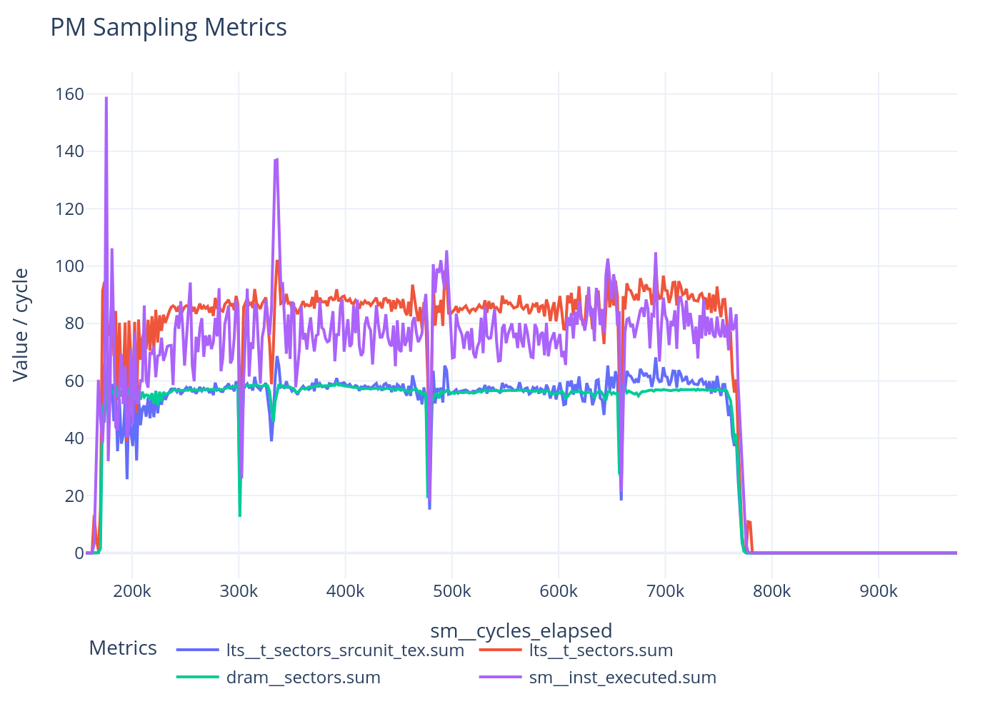

# CUPTI PM Sampling Tool

Hardware performance counter sampling using CUPTI PM Sampling API.

## Requirements
* CUDA Toolkit with CUPTI support (tested with CUDA 12.8+)
* CMake 3.18+
* GPU with compute capability >= 7.5 (Turing+)

## Build
```bash
mkdir build && cd build
cmake ..
make
```

This produces:
* `libpmsampling_injection.so` - Injection library for profiling any CUDA application
* `test_kernel` - Simple CUDA test binary for metric sweeps

## Quick Start

Before running, set `LD_LIBRARY_PATH` to include the CUPTI libraries. The exact path depends on your CUDA version and installation (see Troubleshooting section).

### Using cupti.sh (Recommended)
The simplest way to profile an application:

```bash
./cupti.sh ./your_cuda_app [args...]
```

Edit `cupti.sh` to customize metrics and sampling parameters.

### Using run_cupti.py (Benchmark Suites)
Profile benchmark suites defined in `apps/define-*.yml`:

```bash
# Profile rodinia benchmarks
./run_cupti.py -B rodinia_2.0-ft

# Custom metrics
./run_cupti.py -B rodinia_2.0-ft -M "sm__cycles_elapsed.avg,dram__bytes.sum"

# One CSV per kernel
./run_cupti.py -B rodinia_2.0-ft -K 1

# Just create run scripts without executing
./run_cupti.py -B rodinia_2.0-ft -n
```

**Options:**
| Flag | Description | Default |
|------|-------------|---------|
| `-B` | Benchmark suite name | `rodinia_2.0-ft` |
| `-D` | CUDA device number | `0` |
| `-M` | Comma-separated metrics | `sm__cycles_elapsed.avg,sm__inst_executed.sum` |
| `-K` | Kernels per output CSV | `1` |
| `-I` | Sampling interval (sysclk ticks) | `3000` |
| `-S` | Max samples per session | `80000` |
| `--hw_buffer` | Hardware buffer size (bytes) | `9388608000` |
| `-n` | Don't run, just create scripts | - |

Output goes to `hw_run/cupti/device-X/cuda_version/benchmark/args/`.

### Manual Usage
```bash
export CUDA_INJECTION64_PATH=./build/libpmsampling_injection.so
export INJECTION_METRICS="sm__cycles_elapsed.avg,dram__bytes.sum"
./your_cuda_app
```

## Environment Variables

| Variable | Description | Default |
|----------|-------------|---------|
| `INJECTION_METRICS` | Comma/space/semicolon-separated list of metrics | `sm__cycles_elapsed.avg` |
| `INJECTION_KERNEL_COUNT` | Kernels per sampling session before flush | `10` |
| `PM_SAMPLING_INTERVAL_SYSCLK` | GPU sysclk ticks between samples | `200000` |
| `PM_SAMPLING_HW_BUFFER_BYTES` | Hardware buffer size in bytes | `1048576` |
| `PM_SAMPLING_MAX_SAMPLES` | Maximum samples per session | `16384` |

## Output

Each sampling session produces a CSV file named `output_N.csv` containing:
- Metric values for each sample
- Start and end timestamps

Use `plot.py` to visualize (writes an interactive Plotly HTML):
```bash
python plot.py output_0.csv
```

Example output — L2 (`lts__t_sectors`), DRAM (`dram__sectors`), and SM instruction
throughput (`sm__inst_executed`) sampled per cycle across a kernel's execution:



## Troubleshooting

### CUPTI_ERROR_NOT_INITIALIZED (error 15)

If you see:
```
Function cuptiProfilerInitialize(&profilerInit) failed with error(15): CUPTI_ERROR_NOT_INITIALIZED
```

This means the CUPTI library cannot be found. Set `LD_LIBRARY_PATH` to include the CUPTI libraries.

The exact path depends on your CUDA version and installation. The CUPTI library location varies - it may be under `cuda/lib64`, `cuda/extras/CUPTI/lib64`, or elsewhere depending on how CUDA was installed. The CUPTI version must also match your CUDA driver version.

### No samples collected (0 in output)

- Ensure the kernel actually runs (not just launched)
- Increase `PM_SAMPLING_INTERVAL_SYSCLK` for very short kernels
- Check that the GPU supports PM sampling (compute capability >= 7.5)

### Metrics not available

Run `gen_metrics.py` to discover which metrics are supported on your GPU:
```bash
python3 gen_metrics.py
```

Results are saved to `metrics/<GPU_NAME>/supported.txt`.

## Generate Supported Metrics

```bash
# Run the sweep (creates folder named after GPU)
python3 gen_metrics.py

# Only test Counter metrics
python3 gen_metrics.py --counters-only

# Custom output directory
python3 gen_metrics.py --output-dir /path/to/results
```

Results are saved to `metrics/<GPU_NAME>/`:
* `metrics.txt` - All metrics from ncu --query-metrics
* `supported.txt` - Metrics that work with PM sampling
